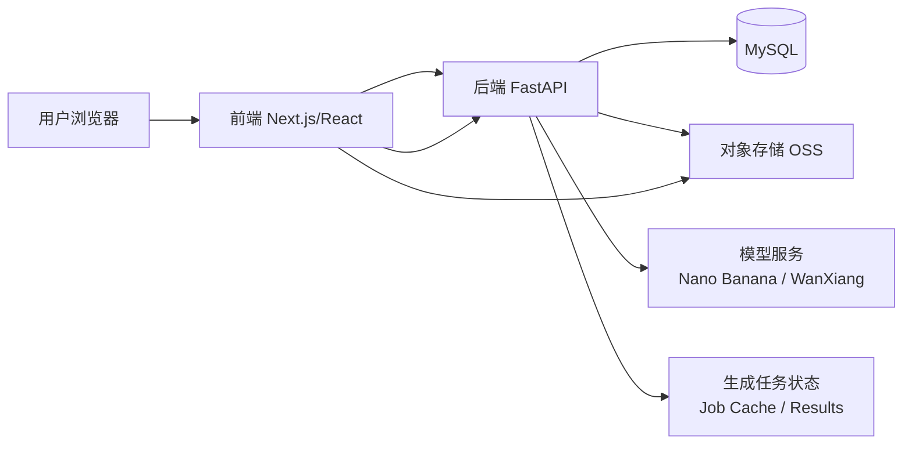
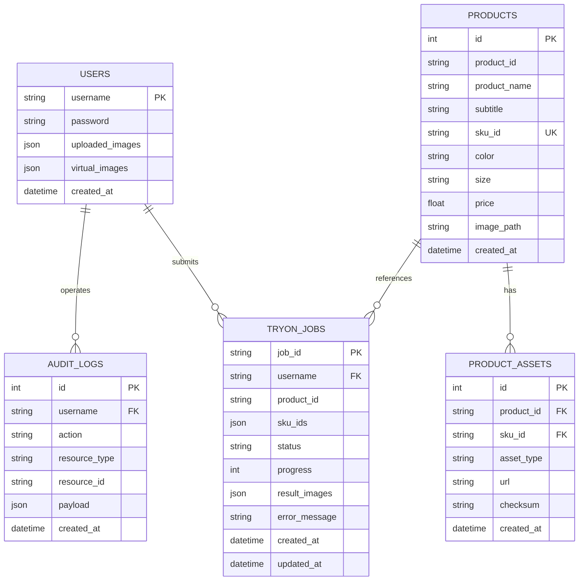

# AI Try-On 技术方案

## 1. 系统总体架构

### 1.1 架构目标
本项目是一个面向虚拟试衣场景的 Web 应用，目标是打通“用户登录 - 商品浏览 - 商品详情 - 选择模特图/商品图 - 调用生成模型 - 查看结果 - 收藏/购物车/历史记录 - 购买”的完整链路，并支持后续商品规模扩大、模型替换和多端接入。

### 1.2 总体架构
系统采用前后端分离架构，核心链路如下：



### 1.3 逻辑分层
- 表现层：Next.js 前端负责页面渲染、交互、状态管理、图片预览与上传、结果展示。
- 接口层：FastAPI 负责认证、商品目录、用户历史、图片上传、试衣生成、任务查询等 API。
- 数据层：MySQL 保存用户、商品、SKU、图片记录、生成任务等数据。
- 资源层：商品图片采用 OSS URL 管理，前端直接消费远程资源；生成结果可本地存储或同步到对象存储。
- 模型层：虚拟试衣调用第三方生成模型服务，按 provider 适配不同提示词和参数。

### 1.4 业务子系统
- 认证子系统：注册、登录、会话识别。
- 商品子系统：商品列表、商品详情、SKU、颜色/尺码/价格展示。
- 用户子系统：上传图片、历史模特图、生成图同步。
- 试衣子系统：单商品试穿、混搭试穿、异步生成、结果缓存。
- 运维子系统：健康检查、数据库自检、日志与告警。

## 2. 技术选型

### 2.1 前端
- 框架：Next.js + React + TypeScript
- 样式：Tailwind CSS
- UI 组件：项目内自定义组件 + 少量基础组件
- 图片处理：原生 `img` 与 `next/image` 结合使用，远程图片以 URL 方式加载
- 上传能力：`react-dropzone`
- 路由：Next.js App Router

选型原因：
- Next.js 适合复杂页面拆分、路由组织和快速迭代。
- TypeScript 提升接口契约和组件协作的稳定性。
- Tailwind 适合快速构建复杂、响应式页面。

### 2.2 后端
- 框架：FastAPI
- ASGI 服务：Uvicorn
- ORM：SQLAlchemy
- 数据库驱动：PyMySQL
- 校验/序列化：Pydantic / FastAPI 原生模型体系
- 文件处理：Python 标准库 + Pillow/图像处理链路（如有需要）

选型原因：
- FastAPI 适合高并发接口和清晰的 API 文档。
- SQLAlchemy 便于后续扩表、迁移和复杂查询。
- PyMySQL 与 MySQL 兼容性好，部署成熟。

### 2.3 数据库
- MySQL 8.x
- 商品、用户、图片记录等采用关系型建模

选型原因：
- 事务、索引、约束成熟，适合商品与用户数据管理。
- 后续可通过分表、读写分离、缓存层扩展。

### 2.4 对象存储与静态资源
- 商品图片：OSS URL
- 用户上传图/生成图：可同步对象存储或本地目录（开发环境）

价值：
- 与应用代码解耦，便于扩容和 CDN 加速。
- 商品数据可独立于图片资源维护。

### 2.5 模型服务
- 当前支持：`nano-banana`、`nano-banana-pro`、`wan-xiang`
- 通过 provider 统一适配请求参数与提示词

### 2.6 部署与开发工具
- 本地运行：`backend/start.sh`、`frontend/start.sh`
- 容器化：Docker / Docker Compose
- 数据库管理：Adminer
- 开发体验：前端热更新、后端快速重启

## 3. API 接口设计

### 3.1 设计原则
- REST 风格，资源路径清晰。
- 统一返回 `success / data / detail` 结构。
- 关键接口支持幂等或可重复调用。
- 上传、生成、查状态分离，避免长请求阻塞。
- 所有接口保留版本前缀 `/api/v1`，便于后续平滑升级。

### 3.2 接口清单

#### 3.2.1 健康检查
- `GET /health`
- `GET /health/db`

用途：
- 进程健康检查
- 数据库可用性检查

#### 3.2.2 商品目录
- `GET /api/v1/catalog/products`
- `GET /api/v1/catalog/products/{slug}`

返回内容：
- 商品名、副标题、sku 列表、颜色、尺码、价格、图片 URL

设计建议：
- 商品列表支持分页、排序、筛选参数
- SKU 返回统一字段：`skuId / color / size / price / image`

#### 3.2.3 认证
- `POST /api/v1/auth/register`
- `POST /api/v1/auth/login`

建议：
- 密码哈希存储
- 登录成功后返回可扩展会话字段
- 后续可升级为 token / session 双模式

#### 3.2.4 用户资料与图片历史
- `GET /api/v1/users/me`
- `POST /api/v1/users/images`
- `POST /api/v1/users/images/upload`
- `DELETE /api/v1/users/images`

用途：
- 获取当前用户的上传图与生成图历史
- 同步图片记录到数据库
- 删除历史记录

#### 3.2.5 模特图生成
- `POST /api/v1/virtual-tryon/model-image`

用途：
- 根据文本提示词生成模特图
- 适合没有真人模特照片时的虚拟试衣输入

#### 3.2.6 试衣任务
- `POST /api/v1/virtual-tryon/jobs`
- `GET /api/v1/virtual-tryon/jobs/{job_id}`
- `POST /api/v1/virtual-tryon`

建议：
- `jobs` 负责异步生成任务
- `GET job` 负责轮询进度与中间结果
- `virtual-tryon` 可作为同步或兼容接口

### 3.3 接口响应规范建议
建议统一如下结构：
```json
{
  "success": true,
  "data": {},
  "detail": ""
}
```
错误返回建议包含：
- HTTP 状态码
- 错误码
- 可读错误信息

### 3.4 接口演进建议
- 增加分页参数：`page / pageSize / limit / cursor`
- 增加请求追踪 ID：`X-Request-Id`
- 增加限流和防刷策略
- 生成任务接口支持取消、重试与超时

## 4. 数据库设计

### 4.0 ER 图



### 4.1 当前核心表

#### 4.1.1 users
用途：保存用户账号和图片历史。

主要字段：
- `username`：主键
- `password`：哈希密码
- `uploaded_images`：上传图列表 JSON
- `virtual_images`：生成图列表 JSON
- `created_at`

索引与约束：
- `username` 主键

#### 4.1.2 products
用途：保存商品 SKU 粒度数据。

主要字段：
- `id`
- `product_id`
- `product_name`
- `subtitle`
- `sku_id`
- `color`
- `size`
- `price`
- `image_path`
- `created_at`

约束建议：
- `sku_id` 唯一
- `product_id` 建索引
- `price` 采用浮点或定点数（更推荐定点数）

### 4.2 推荐扩展表

#### 4.2.1 tryon_jobs
用于保存生成任务状态。
- `job_id`
- `username`
- `product_id`
- `sku_ids`
- `status`
- `progress`
- `result_images`
- `error_message`
- `created_at`
- `updated_at`

#### 4.2.2 product_assets
若后续商品图不再直接放在 products 中，可拆出资源表。
- `product_id`
- `sku_id`
- `asset_type`
- `url`
- `checksum`
- `created_at`

#### 4.2.3 audit_logs
用于记录关键操作。
- 登录
- 上传
- 生成
- 删除
- 导入

### 4.3 数据一致性建议
- 商品导入采用 `sku_id` 幂等 upsert。
- 用户图片同步采用“数据库记录 + OSS URL”双写策略。
- 图片资源建议记录 checksum，便于排查重复与损坏。

## 5. 非功能性设计

### 5.1 性能设计

#### 5.1.1 图片输入降耗
- 前端上传前压缩。
- 模特图和商品图采用不同长边阈值。
- 保留原图，仅向模型提交压缩版。

#### 5.1.2 缓存策略
- 试衣结果按“用户名 + SKU 组合”缓存。
- 商品目录可做前端内存缓存或 HTTP 缓存。
- 用户历史图在前端和后端均可做短期缓存。

#### 5.1.3 异步化
- 试衣生成任务异步执行。
- 前端轮询任务状态，避免长连接阻塞。

#### 5.1.4 静态资源加速
- 商品图片走 OSS / CDN。
- 前端优先远程加载，不依赖本地静态目录。

#### 5.1.5 接口性能优化
- 商品列表分页。
- 数据库索引优化。
- 热点数据缓存。
- 提示词与模型参数模板化，减少重复拼装开销。

### 5.2 兼容性设计
- 浏览器兼容：Chrome、Edge、Safari 主流版本。
- 响应式布局：桌面端和移动端都可操作。
- 图片兼容：JPG、PNG、WebP。
- API 兼容：保留 `/api/v1` 版本号，避免升级破坏现网。
- 数据兼容：登录密码支持旧明文到哈希的平滑升级。

### 5.3 监控与告警方案

#### 5.3.1 监控指标
- API 响应时间
- HTTP 5xx 比例
- 数据库连接成功率
- 生成任务成功率与失败率
- 模型调用耗时
- 图片上传成功率
- 缓存命中率

#### 5.3.2 日志采集
- 后端结构化日志，至少包含：时间、请求 ID、用户、接口名、耗时、错误信息。
- 生成任务日志单独记录 provider、prompt、输入 SKU、耗时和结果状态。

#### 5.3.3 告警建议
- 接口 5xx 比例连续 5 分钟超阈值告警
- 数据库连接失败告警
- 生成任务失败率连续升高告警
- 模型 provider 超时或无响应告警
- OSS 资源读取失败告警

#### 5.3.4 可观测性工具建议
- 日志：Loki / ELK
- 指标：Prometheus + Grafana
- 错误追踪：Sentry
- 链路追踪：OpenTelemetry

## 6. 部署与运维方案

### 6.1 部署架构

#### 6.1.1 开发环境
- Frontend：`frontend/start.sh`
- Backend：`backend/start.sh`
- MySQL：Docker Compose 启动
- Adminer：用于本地查看数据

#### 6.1.2 生产环境建议
- Nginx：统一反向代理与静态资源缓存
- Frontend：Next.js 生产构建后部署
- Backend：FastAPI + Uvicorn/Gunicorn 组合
- MySQL：独立数据库实例
- OSS：存放商品图、用户图、生成图
- 监控：日志、指标、告警平台

### 6.2 CI/CD 流程
建议采用 GitHub Actions 或同类 CI：

1. 提交代码到分支
2. 触发前端 lint / build
3. 触发后端单测 / 启动检查 / 接口冒烟测试
4. 构建 Docker 镜像
5. 推送镜像仓库
6. 部署到测试环境
7. 人工确认后发布生产环境

### 6.3 发布策略
- 配置和代码分离
- 环境变量通过 `.env` 或密钥管理系统注入
- 前端静态资源使用带版本号的构建产物
- 后端服务用镜像标签区分版本

### 6.4 回滚方案
#### 6.4.1 应用回滚
- 保留最近 3 版镜像
- 通过镜像 tag 快速切回上一版
- 前端和后端分开回滚，避免互相拖累

#### 6.4.2 数据回滚
- 数据库迁移必须向后兼容
- 对破坏性变更先做灰度
- 重要表优先做备份和增量恢复

#### 6.4.3 配置回滚
- 配置版本化管理
- 出现异常时优先回滚配置，再回滚代码

### 6.5 运维检查清单
- 服务进程健康
- 数据库连接正常
- 商品目录接口可用
- 生成 provider 可用
- OSS 读写正常
- 试衣任务队列无积压
- 日志无异常堆积

## 7. 风险与改进优先级

### 7.1 主要风险
1. 模型 provider 不稳定，可能出现超时、限流、结果波动。
2. 图片输入过大导致成本上升和生成延迟。
3. 商品数据与图片资源可能出现不一致。
4. 生成任务量增大后，同步处理会拖慢主接口。
5. 监控不足时，问题难以及时定位。
6. 数据库结构继续扩展后，迁移和兼容成本会上升。

### 7.2 改进优先级

#### P0

- 试衣生成任务异步化与状态机完善
- 统一图片压缩与输入尺寸控制
- 接口健康检查与告警补齐
- 商品与 SKU 数据持续幂等化导入

#### P1

- 商品目录与详情缓存
- 生成结果缓存与复用策略优化
- OSS/CDN 加速与资源一致性校验
- 前后端日志统一规范

#### P2

- 任务队列系统（如 Redis Queue / Celery / RabbitMQ）
- 完整指标面板与链路追踪
- 自动化灰度发布与蓝绿部署
- 细粒度权限、审计和运营后台

### 7.3 迭代建议
- 短期先保证稳定性、成本可控、接口可观测。
- 中期补齐任务异步化和缓存层。
- 长期建设标准化发布、监控与多环境运维体系。

## 8. 总结
本项目已经具备“商品数据库化、用户数据闭环、试衣生成链路、对象存储图片管理、前后端分离”的完整基础，下一阶段的重点应放在：
- 降本：图片压缩、缓存、CDN
- 稳定：异步任务、监控、告警
- 扩展：商品规模、SKU 复杂度、模型 provider 可替换
- 交付：CI/CD、回滚、灰度发布
